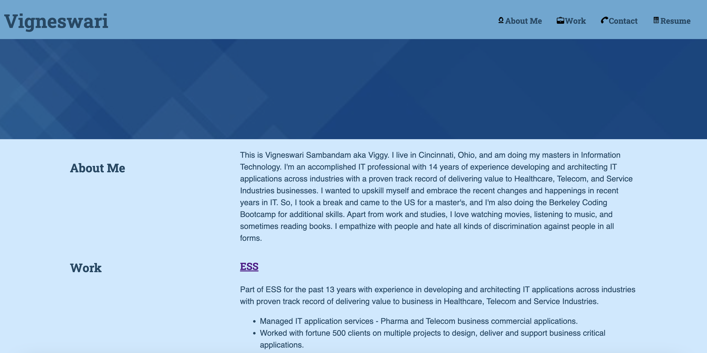

# aboutVigneswari

## Description

This webpage was created to demonstrate the knowledge gained in the CSS week in coding boot camp and as a part of the class assignment submission. The portfolio page was developed using HTML and CSS technology. The HTML page is also accustomed to mobile version and SEO requirements as it uses semantic elements wherever possible.

## Installation

N/A

## Usage

To use this webpage, click the HTML page, which will open in the browser. The view the code, open the webpage in an HTML editor. When opened in a browser, the HTML page is viewed as below.

The resource can be accessed from the link, https://github.com/Vigneshwarie/aboutVigneswari

## Credits

N/A

## License

Please refer to the LICENSE in the repo.
